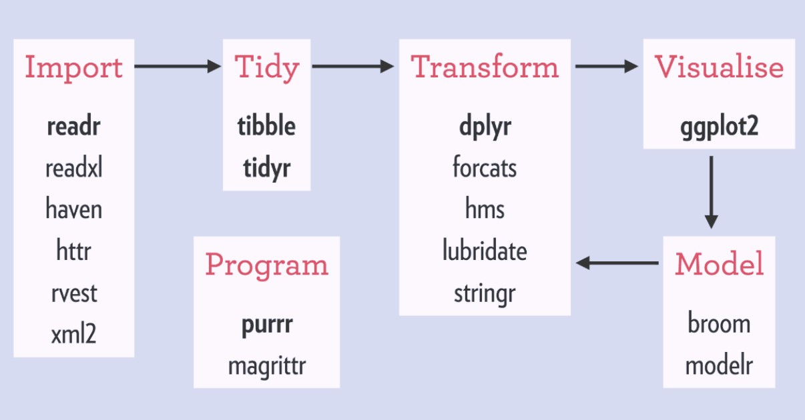
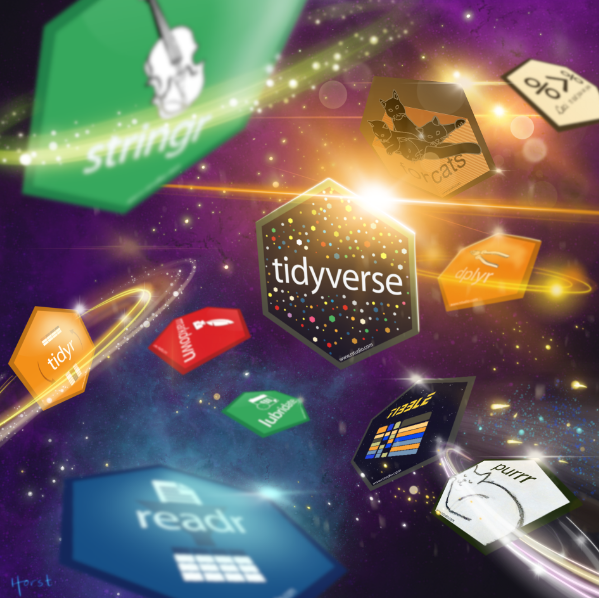
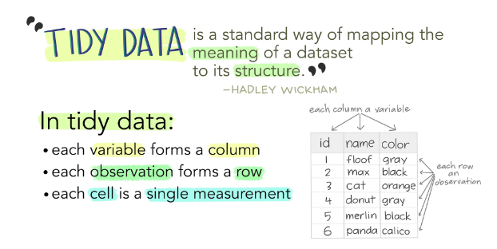
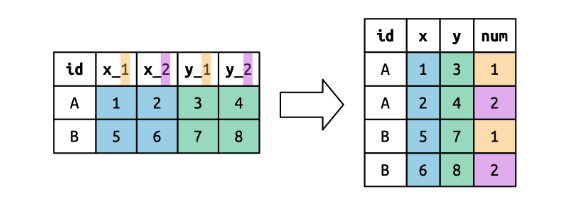
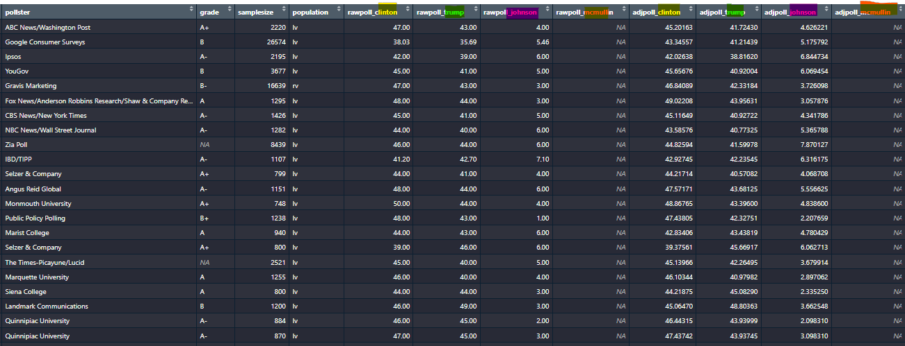
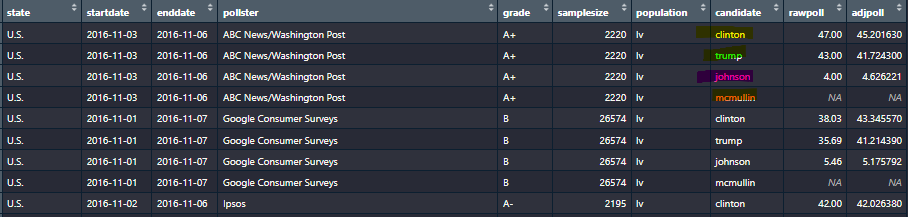
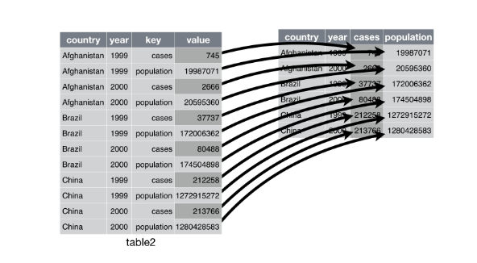
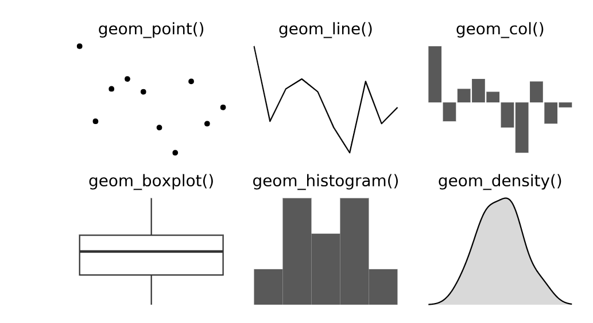

class: cover-slide clear
```{r, out.width = "95%", include=T, echo=F}


```

---

class: title-slide, clear

# Data Analyis with Tidyverse

### DIME Analytics 
### Mer Reyes Retana

### December 7th, 2023

&nbsp;

You can find this presentation and all the materials I will use for the training in [this repository](https://github.com/dime-worldbank/data_analysis_tidyverse)

```{r setup, include = FALSE}

# Load packages
library(knitr)
library(hrbrthemes)
library(fontawesome)
library(here)
library(xaringanExtra)
library(countdown)
library(graphics)

options(htmltools.dir.version = FALSE)
opts_chunk$set(
    message = FALSE,
  warning = FALSE,
  fig.align = "center",
  fig.height = 4,
  dpi = 300,
  cache = T
  )

xaringanExtra::use_panelset()
xaringanExtra::use_webcam()
xaringanExtra::use_clipboard()
htmltools::tagList(
  xaringanExtra::use_clipboard(
    success_text = "<i class=\"fa fa-check\" style=\"color: #90BE6D\"></i>",
    error_text = "<i class=\"fa fa-times-circle\" style=\"color: #F94144\"></i>"
  ),
  rmarkdown::html_dependency_font_awesome()
)

xaringanExtra::use_logo(
  image_url = here("Presentations",
                   "img",
                   "lightbulb.png"),
  exclude_class = c("inverse", 
                    "hide_logo"),
  width = "50px"
)
```

```{css, echo = F, eval = T}
@media print {
  .has-continuation {
    display: block !important;
  }
}

.remark-slide-content {
    font-size: 23px;
}
```
---
# Table of contents

1. [Introduction](#introduction)
1. [Tidy Workflow](#tidy-workflow)
1. [Tidy Verbs](#tidy-verbs)
1. [Data Visualization](#data-visualization)
1. [Conclusion and References](#conclusions)

---
class: section-slide
name: introduction

# **Introduction**

<html><div style='float:left'></div><hr color='#D38C28' size=1px width=1100px></html>

---

# Motivation

## The Critical Role of Data Preparation

**Data Science and Economics:**  
- Significant time invested in data preparation
- Survey results indicate over 50% of time spent in cleaning and getting data ready

## The Challenge

- Data preparation is often challenging and time-consuming
- A crucial step in achieving accurate and reliable analysis

## Solution: Tidyverse in R

- `tidyverse`: A collection of R packages designed for data science
- Enhances efficiency and bearability in data preparation

---
# Motivation

## Who Should Attend?

- This session is open to **anyone who knows R** and is looking to **improve the style and efficiency of their code**.

--

## Requirements

- **Access to Materials**: Clone or download [this repository](https://github.com/dime-worldbank/data_analysis_tidyverse) to access the presentation materials.
- **No need to code along live**. Just sit back, and absorb the concepts.
- **After the session** you can work through the example (example/analysis_tidyverse_examples.R) at your own pace, enhancing your understanding of the Tidyverse.

---

# What is the Tidyverse?

- **The best way to use R** is by using the multiple packages it offers.
- **One such set of packages** that we are focusing on is the `tidyverse`.

```{r, out.width = "600px", include=T, echo=F}



```

- A cohesive series of R packages
- Designed with a common philosophy
- Streamlines data import, tidying, transformation, visualization, and modeling

---
class: section-slide
name: tidy-workflow

# **Tidy Workflow**

<html><div style='float:left'></div><hr color='#D38C28' size=1px width=1100px></html>

---

# Prepare your Workspace

- Install the `tidyverse` packages:

```{r, eval=FALSE}
  install.packages("tidyverse")
  install.packages("dslabs")
  
```

- Download/Clone [this repository](https://github.com/dime-worldbank/data_analysis_tidyverse) in your computer. 

- Ready to dive in. 


```{r, out.width = "400px", include=T, echo=F}



```


---

# Prepare your Workspace 

**Script Set-up**

- We start by adding the libraries we will use in the project. 

```{r, eval=FALSE}
library(tidyr) # Data tidying 
library(dplyr) # Data manipulation
library(ggplot2) # Data visualization
library(dslabs) # Contains the data we will use in this presentation. 
```

- Read the data 

```{r, eval=FALSE}
data(polls_us_election_2016, package = "dslabs") # load data from package
polls_us_election_2016 <- as_tibble(polls_us_election_2016) # convert to a tibble
```

---

# Data: 2016 US election polls from the `dslabs` package
* This dataset contains __real__ data on polls made during the 2016 US Presidential elections and compiled by [fivethirtyeight](fivethirtyeight.com)

```{r dslabs, echo = TRUE, warning=FALSE}
library(dslabs)
library(tidyverse)
data(polls_us_election_2016, package = "dslabs") # load data from package
polls_us_election_2016 <- as_tibble(polls_us_election_2016) # convert to a tibble
head(polls_us_election_2016) # show first 6 lines of first 6 variables
```

```{r, eval=FALSE, echo=FALSE}

#Tibbles are data.frames that are lazy and surly: they do less (i.e. they don’t change variable names or types, and don’t do partial matching) and complain more (e.g. when a variable does not exist).  (nicer looking data.frames.)
```


---

# Data: 2016 US election polls from the `dslabs` package
What variables does this dataset contain?

```{r}
str(polls_us_election_2016) # Displays structures of R objects
```

---

# The pipe operator 

- Reading and understanding multiple operations can be difficult.
- Parameters are typically assigned after the function name using `()`.

```{r, eval=FALSE}
summarise(
  group_by(
    filter(polls_us_election_2016, !is.na(samplesize)),
    pollster,
    state
  ), 
  n = n()
)
```

- This approach can get complex really easy creating unreadable code.

---

# The pipe operator

- The pipe operator (**|>**  or **%>%**) can help with this.  

- The pipe is a tool to chain commands more clearly. 

- With the pipe, code reads from left to right, top to bottom, which is more intuitive.

|>  or %>% can be read as "then" and simplifies code structure.

```{r, eval=FALSE}
polls_us_election_2016 %>% 
  filter(!is.na(samplesize)) %>%
  group_by(pollster, state) %>% 
  summarise(
    n = n()
  ) 
```

**Tip**: Use Shift + Ctrl/Cmd + M as a shortcut for the pipe operator.

---
class: section-slide
name: tidy-verbs

# **Tidy Verbs**

<html><div style='float:left'></div><hr color='#D38C28' size=1px width=1100px></html>

---

# Tidy Verbs

The Tidyverse packages are a great tool to **tidy data** and perform operations on **tidy data ** 

```{r, out.width = "800px", include=T, echo=F}



```

---
# Tidy Verbs

The `tidyverse` ecosystem is composed of multiple packages, each equipped with specific "verbs" to streamline the data workflow process. We'll focus on the verbs from two pivotal packages: `tidyr` and `dplyr`.

* You are ***highly encouraged*** to read through [Hadley Wickham's chapter](https://r4ds.had.co.nz/transform.html). It's clear and concise.

* Also check out these great "cheatsheets" [dplyr](https://github.com/rstudio/cheatsheets/blob/master/data-transformation.pdf) and [tidyr](https://github.com/rstudio/cheatsheets/blob/main/tidyr.pdf).

---

# Tidy Verbs

* The packages are organized around a set of **verbs**, i.e. *actions* to be taken.

* We operate on `data.frames` or `tibbles` (*nicer looking* data.frames.)

--

* All *verbs* work as follows:

$$\text{verb}(\underbrace{\text{data.frame}}_{\text{1st argument}}, \underbrace{\text{what to do}}_\text{2nd argument})$$


--

* Alternatively you can (**should**) use the `pipe` operator `%>%`:

$$\underbrace{\text{data.frame}}_{\text{1st argument}} \underbrace{\text{ %>% }}_{\text{"pipe" operator}} \text{verb}(\underbrace{\text{what to do}}_\text{2nd argument})$$

---

# Main `tidyr` Verbs

* `tidyr` is designed to tidy your data.

1. `pivot_longer()`: Lengthens data, increasing the number of rows and decreasing the number of columns.

--

1. `pivot_wider()`: Widens data, increasing the number of columns and decreasing the number of rows.

--

1. `separate()`: Splits a column into multiple columns.

--

1. `unite()`: Combines multiple columns into a single column.

--

* These verbs help transform data frames or tibbles to a tidy format, where each variable is a column, each observation is a row, and each type of observational unit forms a table.

---

# `tidyr::pivot_longer()`

Some of the **most useful** verbs in the tidyverse package, and particularly important to achieve tidy data, are the reshape verbs. 

The first reshape operation involves making datasets longer by increasing the number of rows and decreasing the number of columns.

```{r, out.width = "1000px", include=T, echo=F}



```

---

# `tidyr::pivot_longer()`

**Example:** we have rawpoll and adjpoll for every candidate in a wide format. Perhaps we want to have this information in two variables (instead of 8) 

```{r, out.width = "1000px", include=T, echo=F}



```

---

# `tidyr::pivot_longer()`

```{r, eval=FALSE}
polls_us_election_2016 %>%
  pivot_longer( #<<
    cols = c(rawpoll_clinton:adjpoll_trump), #<<
    names_to = c(".value", "candidate"), #<<
    names_pattern = "(rawpoll|adjpoll)_(.*)" #<<
  )

```

```{r, out.width = "800px", include=T, echo=F}



```
---

# `tidyr::pivot_wider()`

This is the contrary of the previous command, there are cases where we have information in a long format and we would like to make it wider.

```{r, out.width = "800px", include=T, echo=F}



```

---

# `tidyr::pivot_wider()`

**Example:** For simplicity, I will wide the previous dataframe, but [here](https://r4ds.hadley.nz/data-tidy.html) you can find multiple examples.

```{r, echo=FALSE}
longer_dataframe <- polls_us_election_2016 %>%
  pivot_longer(
    cols = c(rawpoll_clinton:adjpoll_mcmullin),
    names_to = c(".value", "candidate"),
    names_pattern = "(rawpoll|adjpoll)_(.*)"
  )


```

```{r, warning=FALSE}
wider_dataframes <- longer_dataframe %>%
  pivot_wider( #<<
    names_from = candidate, #<<
    values_from = c(rawpoll, adjpoll),  #<<
    values_fn = list
  )
```

---

# `tidyr::separate()`

Splits a column into multiple columns

**Example:** Divide enddate into year, month and day.

```{r}
polls_us_election_2016 %>%
  separate(enddate, into = c("year", "month", "day"), sep = "-") #<<
```

---

# `tidyr::unite()`

Combines multiple columns into a single column. 

**Example:** Using the previous example, unite the "year", "month", "day" back into "enddate"

```{r, echo=FALSE}
separated_data <- polls_us_election_2016 %>%
  separate(enddate, into = c("year", "month", "day"), sep = "-")
```


```{r}
separated_data %>%
  unite("enddate", c("year", "month", "day"), sep = "-") #<<
```

---

# Main `dplyr` Verbs

- `dplyr` helps you with the main data manipulation challenges.

1. `select()`: Choose certain variables by name

--

1. `filter()`: Subset observations based on a certain condition.

--

1. `arrange()`: Reorder rows based on a certain condition.

--

1. `mutate()`: Create new variables.

--

1. `summarise()`: Collapse data to a single summary

--

1. `group_by()`: All the above can be used in conjunction with `group_by()` to use function on groups rather than entire data

---

# `dplyr::select()` 


*Example:* Only keep the variables `state, startdate, enddate, pollster, rawpoll_clinton, rawpoll_trump`


```{r, eval = FALSE}
polls_us_election_2016 %>%
  select(state,startdate,enddate,pollster,rawpoll_clinton,rawpoll_trump) #<<
```

```{r, echo = FALSE}
polls_us_election_2016 %>%
  select(state,startdate,enddate,pollster,rawpoll_clinton,rawpoll_trump)
```

---

# `dplyr::filter()` 


*Example:* Which polls had a sample size of at least 2,000 people?


--


```{r, eval=FALSE}
polls_us_election_2016 #<<
```

```{r, echo=FALSE}
polls_us_election_2016 #<<
```

---

# `dplyr::filter()`

*Example:* Which polls had a sample size of at least 2,000 people?


```{r, eval=FALSE}
polls_us_election_2016 %>%
  filter(samplesize > 2000) #<<
```

```{r, echo=FALSE}
polls_us_election_2016 %>%
  filter(samplesize > 2000)
```


---

# `dplyr::filter()`

Standard suite of comparison operators:
- `>`: greater than,
- `<`: smaller than,
- `>=`: greater than or equal to,
- `<=`: smaller than or equal to,
- `!=`: not equal to,
- `==`: equal to.

Logical operators:
1. `x & y`: `x` **and** `y`
1. `x | y`: `x` **or** `y`
1. `!y`: **not** `y`


---

# `dplyr::filter()`

*Example:* Which A graded poll with at least 2,000 people had Trump win at least 45% of the vote?


```{r, eval=FALSE}
polls_us_election_2016 %>%
  filter(grade == "A" & samplesize > 2000 & rawpoll_trump > 45) #<<
```

```{r, echo=FALSE}
polls_us_election_2016 %>%
  filter(grade == "A" & samplesize > 2000 & rawpoll_trump > 45)
```

---

# `dplyr::arrange()` 

*Example:* Sort the dataframe in terms of the sample size. 

```{r}
polls_us_election_2016 %>% 
  arrange(samplesize) # this will do it from smaller to larger by default
```

---

# `dplyr::mutate()` 

*Example:* What was...

1. the combined vote share of Trump and Clinton for each poll?
2. the difference between Trump's raw poll vote share and 538's adjusted vote share?

```{r, eval = FALSE}
polls_us_election_2016 %>%
  mutate(trump_clinton_tot = rawpoll_trump + rawpoll_clinton, #<<
         trump_raw_adj_diff = rawpoll_trump - adjpoll_trump) #<<
```

```{r, echo = FALSE}
polls_us_election_2016 %>%
  mutate(trump_clinton_tot = rawpoll_trump + rawpoll_clinton,
         trump_raw_adj_diff = rawpoll_trump - adjpoll_trump)
```

---

# `dplyr::mutate()`  

*Example:* What was...
1. the combined vote share of Trump and Clinton for each poll?
2. the difference between Trump's raw poll vote share and 538's adjusted vote share?

```{r, eval = FALSE}
polls_us_election_2016 %>%
  mutate(trump_clinton_tot = rawpoll_trump + rawpoll_clinton,
         trump_raw_adj_diff = rawpoll_trump - adjpoll_trump) %>%
  names() #<<
```

```{r, echo = FALSE}
polls_us_election_2016 %>%
  mutate(trump_clinton_tot = rawpoll_trump + rawpoll_clinton,
         trump_raw_adj_diff = rawpoll_trump - adjpoll_trump) %>%
  names()
```

---

# `dplyr::summarise()` 

Compute statistics

*Example:* What is the maximum vote share for Trump?

```{r, eval = FALSE}
polls_us_election_2016 %>%
  summarise(max_trump = max(rawpoll_trump)) #<<
```

```{r, echo = FALSE}
polls_us_election_2016 %>%
  summarise(max_trump = max(rawpoll_trump))
```

---

# `dplyr::group_by()` 

*Example:* What is the average vote share for Clinton by poll grade?


```{r, eval = FALSE}
polls_us_election_2016 %>%
  group_by(grade) #<<
```

```{r, echo = FALSE}
polls_us_election_2016 %>%
  group_by(grade)
```


---

# `dplyr::group_by()` 

*Example:* What is the average vote share for Clinton by poll grade?

```{r, eval = FALSE}
polls_us_election_2016 %>%
  group_by(grade) #<<
```

```{r, echo = FALSE}
polls_us_election_2016 %>%
  group_by(grade)
```


---

# `dplyr::group_by()` 

*Example:* What is the average vote share for Clinton by poll grade?

```{r, eval = FALSE}
polls_us_election_2016 %>%
  group_by(grade) %>%
  summarise(mean_vote_clinton = mean(rawpoll_clinton)) #<<
```

```{r, echo = FALSE}
polls_us_election_2016 %>%
  group_by(grade) %>%
  summarise(mean_vote_clinton = mean(rawpoll_clinton))
```

---

# Chaining commands

With these verbs and the pipe chaining commands helps tidy your workflow, you can do multiple of this operations at the same time.
(for tidyverse verbs and others)

```{r}
polls_us_election_2016 %>% 
  pivot_longer( #<<
    cols = c(rawpoll_clinton:adjpoll_mcmullin),
    names_to = c(".value", "candidate"),
    names_pattern = "(rawpoll|adjpoll)_(.*)"
  ) %>% # reshape
  select(-enddate) %>%  # everything except enddate
  filter(samplesize>=2000) %>%  # filter sample size greater than 2,000
  group_by(state, candidate) %>% #group by state and candidate
  summarise(rawpoll = mean(rawpoll, na.rm = TRUE)) # summarise 
  
```
---

# Chaining commands

With these verbs and the pipe chaining commands helps tidy your workflow, you can do multiple of this operations at the same time.
(for tidyverse verbs and others)

```{r}
polls_us_election_2016 %>% 
  pivot_longer( #<<
    cols = c(rawpoll_clinton:adjpoll_mcmullin),
    names_to = c(".value", "candidate"),
    names_pattern = "(rawpoll|adjpoll)_(.*)"
  )  # reshape
  
```

---
# Chaining commands

With these verbs and the pipe chaining commands helps tidy your workflow, you can do multiple of this operations at the same time.
(for tidyverse verbs and others)

```{r}
polls_us_election_2016 %>% 
  pivot_longer( 
    cols = c(rawpoll_clinton:adjpoll_mcmullin),
    names_to = c(".value", "candidate"),
    names_pattern = "(rawpoll|adjpoll)_(.*)"
  ) %>% # reshape
  select(-enddate) # everything except enddate #<<
```
---

# Chaining commands

With these verbs and the pipe chaining commands helps tidy your workflow, you can do multiple of this operations at the same time.
(for tidyverse verbs and others)

```{r}
polls_us_election_2016 %>% 
  pivot_longer( 
    cols = c(rawpoll_clinton:adjpoll_mcmullin),
    names_to = c(".value", "candidate"),
    names_pattern = "(rawpoll|adjpoll)_(.*)"
  ) %>% # reshape
  select(-enddate) %>%  # everything except enddate
  filter(samplesize>=2000) # filter sample size greater than 2,000 #<< 
  
```
---

# Chaining commands

With these verbs and the pipe chaining commands helps tidy your workflow, you can do multiple of this operations at the same time.
(for tidyverse verbs and others)

```{r}
polls_us_election_2016 %>% 
  pivot_longer( 
    cols = c(rawpoll_clinton:adjpoll_mcmullin),
    names_to = c(".value", "candidate"),
    names_pattern = "(rawpoll|adjpoll)_(.*)"
  ) %>% # reshape
  select(-enddate) %>%  # everything except enddate
  filter(samplesize>=2000) %>%   # filter sample size greater than 2,000
  group_by(state, candidate) %>% #group by state and candidate #<<
  summarise(rawpoll = mean(rawpoll, na.rm = TRUE)) # summarise #<< 
  
```
---

class: section-slide
name: data-visualization

# **Data Visualization**

<html><div style='float:left'></div><hr color='#D38C28' size=1px width=1100px></html>

---

# Data Visualization

* There is an extremely powerful tool in the `tidyverse`: `ggplot2`

gg is for Grammar of Graphics

How do we express visual in words? 

- **Data** to be visualized

- **Aes**thetics mappings from data to visual component

- **Geom**etric objects that appear on the plot

(and more but we will keep it simple) for more you can see [this presentation](https://pkg.garrickadenbuie.com/gentle-ggplot2/#1)

---

# Data

#### Tidy Data

1. Each variable forms a ***column***

2. Each observation forms a ***row***

3. Each observational unit forms a table

#### Start by asking

1. What information do I want to use in my visualization?

1. Is that data contained in ***one column/row*** for a given data point?

---

# Data 

 We will use our same dataframe to show this. 

```{r, eval=FALSE}
longer_dataframe %>% 
ggplot()
  
```

or 

```{r, eval=FALSE}
ggplot(longer_dataframe)
```

---

# Aesthetics

Map data to visual elements or parameters

- date → **x**

- vote → **y**

- candidate → *shape*, *color*, etc.

---

# Aesthetics

```{r, eval=FALSE}
longer_dataframe %>% 
  filter(state == "District of Columbia") %>% 
  ggplot() +
  aes(x = enddate,  #<<
      y = rawpoll,  #<<
      color = candidate) #<< 
  
```
---
# Geoms

Geometric objects displayed on the plot 

```{r, out.width = "800px", include=T, echo=F}



```

---

# Geoms

```{r, eval=FALSE}
longer_dataframe %>% 
  filter(state == "District of Columbia") %>% 
  ggplot() +
  aes(x = enddate, 
      y = rawpoll, 
      color = candidate) +
  geom_line() #<<
  
```

---

# Geoms

```{r, echo=FALSE, fig.width=3, fig.height=2}
longer_dataframe %>% 
  filter(state == "District of Columbia") %>% 
  ggplot() +
  aes(x = enddate, 
      y = rawpoll, 
      color = candidate) +
  geom_line() #<<
  
```

---

# Extra

We can make it prettier, and do many more things with ggplot, please explore on your own. 

```{r, eval=FALSE}
longer_dataframe %>% 
  filter(state == "District of Columbia") %>% 
  ggplot() +
  aes(x = enddate, 
      y = rawpoll, 
      color = candidate) +
  geom_line() +
  theme_minimal() + # minimal theme (delete extra lines)
  theme(
  legend.position = "bottom" # position of legend
  ) +
  labs( # Define title and labels
    y = "Raw Poll",
    x = "Date of the Poll",
    title = "2016 Elections Polls in District of Columbia"
  )
    
```

---

# Extra

We can make it prettier, and do many more things with ggplot, please explore on your own. 

```{r, echo=FALSE, fig.width=2.5, fig.height=1.8}
longer_dataframe %>% 
  filter(state == "District of Columbia") %>% 
  ggplot() +
  aes(x = enddate, 
      y = rawpoll, 
      color = candidate) +
  geom_line() +
  theme_minimal() + # minimal theme (delete extra lines)
  theme(
    legend.position = "bottom",
    text = element_text(size = 7), # Adjust text size here
    axis.text.x = element_text(angle = 45, hjust = 1) # Angle x-axis text for dates
  ) +
  labs( # Define title and labels
    y = "Raw Poll (%)",
    x = "Date of the Poll",
    title = "2016 Elections Polls, D.C."
  )
    
```

---

# Conclusion

Do the best you can until you know better, when you know better do better...

### Thank you!

<iframe src="https://giphy.com/embed/35DsASlwZ6uX93uEJo" width="600" height="400" frameBorder="0" class="giphy-embed" allowFullScreen></iframe>
---

# References

I largely based this slides on the presentation by Florian Oswald and Mylene Feuillade that you can find [here](https://raw.githack.com/ScPoEcon/ScPoEconometrics-Slides/master/chapter_tidy_programming/chapter_tidy.html#2) and [here](https://github.com/mylenefeuillade/ScPoEconometrics-Slides/blob/master/chapter_tidy)

## More resources

- You are ***highly encouraged*** to read through [Hadley Wickham's chapter](https://r4ds.had.co.nz/transform.html). It's clear and concise.

- Also check out this great dplyr "cheatsheet" [here](https://github.com/rstudio/cheatsheets/blob/master/data-transformation.pdf).

- As well as this tidyr "cheatsheet" [here](https://github.com/rstudio/cheatsheets/blob/main/tidyr.pdf).

- Garrick Aden-Buie ggplot presentation [here](https://pkg.garrickadenbuie.com/gentle-ggplot2/#1).

- The R Graph Gallery [here](https://r-graph-gallery.com/).

- Illustrations by [Allison Horst](https://allisonhorst.com/r-packages-functions). 


